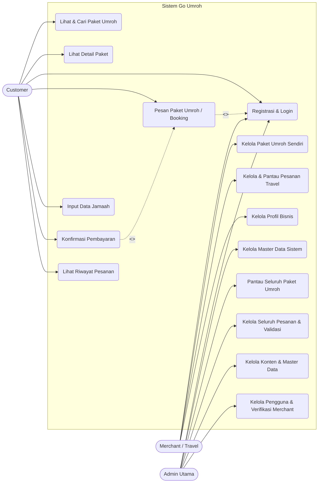
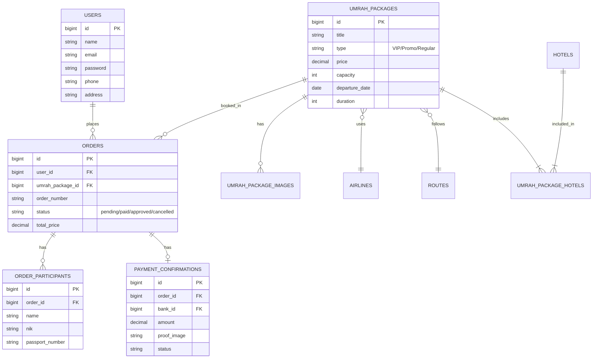
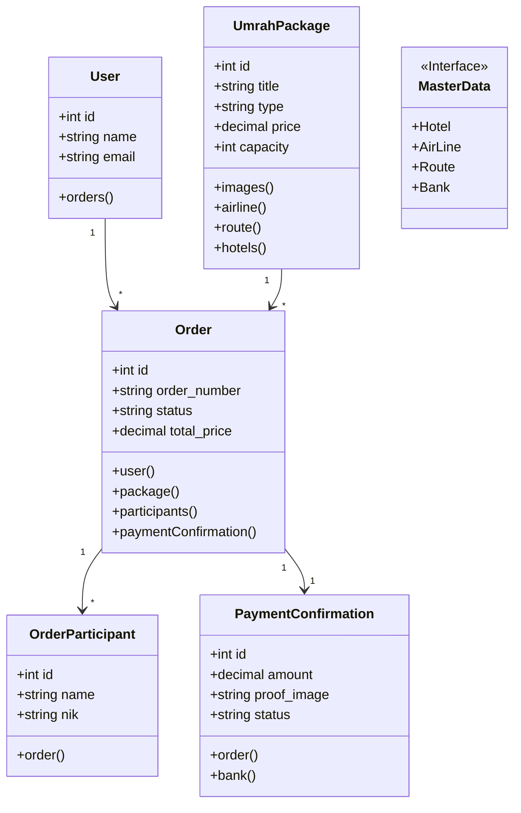
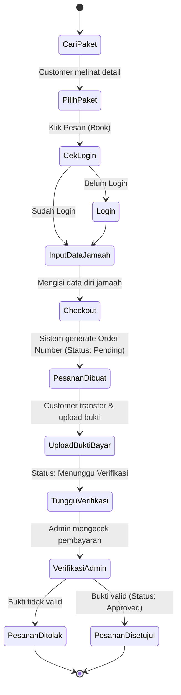

# System Design Diagrams - Go Umroh

Berikut adalah diagram-diagram rancangan sistem untuk aplikasi Go Umroh. Semua diagram digenerate menggunakan **Mermaid.js**.

## 1. Use Case Diagram

Diagram ini menunjukkan interaksi antara aktor (Customer dan Admin) dengan sistem Go Umroh.

*(Catatan: Mermaid.js belum memiliki dukungan bawaan yang sempurna untuk Use Case diagram standar UML. Namun, diagram ER dan Activity di bawah ini jauh lebih detail).*

---

## 2. Entity Relationship Diagram (ERD)

Diagram ini menunjukkan struktur tabel database dan relasi antar entitas utama di sistem.

---

## 3. Class Diagram

Diagram ini merepresentasikan struktur class (Model) pada backend Laravel beserta atribut utama dan metode relasinya.

---

## 4. Activity Diagram (Alur Pemesanan Paket Umroh)

Diagram ini menjelaskan alur aktivitas seorang Customer dari mulai memilih paket hingga pesanan disetujui (Approved) oleh Admin.

